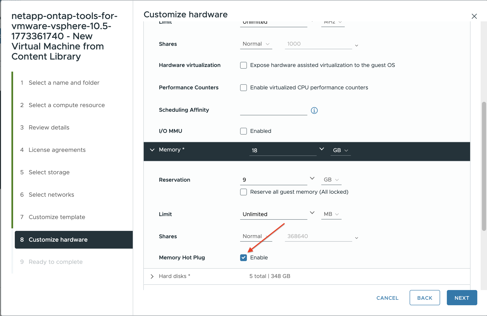

= Distribuisci ONTAP tools
:allow-uri-read: 
:icons: font
:imagesdir: ../media/

[role="lead"]
L'appliance ONTAP tools for VMware vSphere viene distribuita come un singolo nodo di piccole dimensioni con servizi di base per supportare i datastore NFS e VMFS. Il processo di distribuzione di ONTAP tools potrebbe richiedere fino a 45 minuti.

.Prima di iniziare
Se stai implementando un singolo nodo di piccole dimensioni, un archivio di contenuti è facoltativo. Per le implementazioni multi-nodo o HA, un archivio di contenuti è obbligatorio. In VMware, un archivio di contenuti memorizza modelli di macchine virtuali, vApp template e altri file. Implementare con un archivio di contenuti offre un'esperienza senza interruzioni perché non dipende dalla connettività di rete.

Considera quanto segue prima di creare un archivio di contenuti:

* Crea l'archivio di contenuti su un archivio dati condiviso in modo che tutti gli host del cluster possano accedervi.
* Configura l'archivio di contenuti prima di distribuire ONTAP tools for VMware vSphere OVA.
* Assicurati che l'archivio di contenuti sia stato creato prima di configurare l'appliance per l'HA.
+

NOTE: Non eliminare il modello OVA dall'archivio di contenuti dopo la distribuzione.

NOTE: Per consentire la distribuzione ad alta disponibilità in futuro, evitare di distribuire la macchina virtuale ONTAP tools direttamente su un host ESXi. Distribuirla invece all'interno di un cluster ESXi host o pool di risorse.

Segui questi passaggi per creare un archivio di contenuti:

. Scarica il file che contiene i binari (_.ova_) e i certificati firmati per ONTAP tools for VMware vSphere dal  https://mysupport.netapp.com/site/products/all/details/otv10/downloads-tab["Sito di supporto NetApp"^].
. Accedi al vSphere client
. Seleziona il menu client vSphere e seleziona *archivio di contenuti*.
. Seleziona *Crea* sulla destra della pagina.
. Assegna un nome alla libreria e crea l'archivio di contenuti.
. Accedi all'archivio di contenuti che hai creato.
. Seleziona *Azioni* sulla destra della pagina, seleziona *Importa elemento* e importa il file OVA.

NOTE: Per ulteriori informazioni, consultare https://blogs.vmware.com/vsphere/2020/01/creating-and-using-content-library.html["Creazione e utilizzo dell'archivio di contenuti"] blog.

NOTE: Prima di procedere con la distribuzione, impostare il Distributed Resource Scheduler (DRS) del cluster su Conservative. Ciò garantisce che le VM non vengano migrate durante l'installazione.

Gli ONTAP tools for VMware vSphere vengono inizialmente distribuiti come configurazione non HA. Per passare a una distribuzione HA, è necessario abilitare la funzionalità di CPU hot-add e memory hot-plug. È possibile eseguire questo passaggio durante il processo di distribuzione oppure modificare le impostazioni della macchina virtuale dopo la distribuzione.

.Passaggi
. Scarica il file che contiene i file binari (_.ova_) e i certificati firmati per gli ONTAP tools for VMware vSphere dal  https://mysupport.netapp.com/site/products/all/details/otv10/downloads-tab["Sito di supporto NetApp"^]. Se hai importato l'OVA nell'archivio di contenuti, puoi saltare questo passaggio e procedere con il prossimo.
. Accedi al vSphere server.
. Vai al pool di risorse, cluster o host dove vuoi distribuire l'OVA.
+

NOTE: Non memorizzare mai la macchina virtuale ONTAP tools for VMware vSphere su datastore vVols che essa gestisce.

. Puoi distribuire il file OVA dall'archivio di contenuti o dal sistema locale.
+
|===

| Dal sistema locale | Dall'archivio di contenuti 

| a. Fai clic con il pulsante destro del mouse e seleziona *Deploy OVF template...*. b. Scegli il file OVA dall'URL o individua la sua posizione, quindi seleziona *Next*. | a. Vai al tuo archivio di contenuti e seleziona l'elemento della libreria che desideri distribuire. b. Seleziona *Azioni* > *Nuova VM da questo modello* 
|===
. Nel campo *Seleziona un nome e una cartella*, inserisci il nome della macchina virtuale e scegli la sua posizione.
+
** Se si utilizza la versione vCenter Server 8.0.3, selezionare l'opzione *Personalizza l'hardware di questa macchina virtuale*, che attiverà un passaggio aggiuntivo denominato *Personalizza l'hardware* prima di procedere alla finestra *Pronto per completare*.
** Se si utilizza la versione vCenter Server 7.0.3, seguire i passaggi descritti nella sezione *Cosa fare dopo?* al termine della distribuzione. image:../media/select-name.png["Seleziona un nome e una cartella"]

. Seleziona una risorsa computer e fai clic su *Avanti*. Facoltativamente, seleziona la casella per *Accendere automaticamente la VM distribuita*.
. Esamina i dettagli del modello e seleziona *Avanti*.
. Leggi e accetta il contratto di licenza e seleziona *Avanti*.
. Seleziona lo storage per la configurazione e il formato del disco, quindi fai clic su *Avanti*.
. Seleziona la rete di destinazione per ciascuna rete di origine e seleziona *Avanti*.
. Nella finestra *Personalizza modello*, compila i campi obbligatori. image:../media/custom-temp-p2.png["Personalizza il modello"]
+
[IMPORTANT]
====
I valori presenti nella pagina *Personalizza modello* sono necessari per una distribuzione riuscita.

Presta particolare attenzione a questi campi:

** *Nome host*: Inserisci l'host name della VM ONTAP tools. Usa un formato di host name valido.
** *Indirizzo IP degli ONTAP tools*: Questa è l'interfaccia di gestione principale utilizzata per accedere agli ONTAP tools.
** *Indirizzo IPv4*: Questo è l'indirizzo IP del nodo utilizzato per la shell diagnostica e l'accesso SSH per la risoluzione dei problemi e la manutenzione.

Se usi nomi DNS per l'host o vCenter, assicurati che quei nomi vengano risolti correttamente nel DNS.

====
+

NOTE: Il nome host vCenter è il nome dell'istanza del server vCenter in cui è distribuita l'appliance ONTAP tools.

+
Se si distribuiscono gli strumenti ONTAP in una topologia a due vCenter Server, in cui l'appliance è ospitata in un'istanza vCenter e ne gestisce un'altra, è possibile assegnare un ruolo con restrizioni per l'istanza vCenter che ospita gli strumenti ONTAP. È possibile creare un utente e un ruolo vCenter dedicati con solo le autorizzazioni necessarie per la distribuzione del modello OVF. Per dettagli, consultare i ruoli elencati in link:../concepts/rbac-vcenter-use.html#vsphere-object-hierarchy["Ruoli inclusi con ONTAP tools for VMware vSphere 10"].

+
Per l'istanza vCenter che verrà gestita da ONTAP tools, assicurati che l'account utente vCenter abbia i privilegi di amministratore.

+
** I nomi host devono includere lettere (A-Z, a-z), cifre (0-9) e trattini (-). Per configurare il dual stack, specifica l'host name mappato all'indirizzo IPv6.
+

NOTE: IPv6 puro non è supportato. La modalità mista è supportata con VLAN che contengono sia indirizzi IPv6 che IPv4.

** L'indirizzo IP di ONTAP tools è l'interfaccia principale per comunicare con ONTAP tools.
** IPv4 è la componente dell'indirizzo IP nella configurazione del nodo, che puoi utilizzare per abilitare la shell diagnostica e l'accesso SSH al nodo per il debug e la manutenzione.

. Quando si utilizza la versione vCenter Server 8.0.3, nella finestra *Personalizza hardware*, abilitare le opzioni *CPU hot add* e *Memory hot plug* per consentire la funzionalità HA. image:../media/customize-hw105-p2-1.png["Hot add della CPU"] 
. Rivedi i dettagli nella finestra *Pronto per completare*, seleziona *Fine*.
+
Man mano che viene creata l'attività di distribuzione, l'avanzamento viene visualizzato nella barra delle attività di vSphere.

. Accendi la VM al termine dell'attività se non hai selezionato l'opzione per accenderla automaticamente.

Puoi monitorare l'avanzamento dell'installazione all'interno della console web della macchina virtuale.

Se nel modulo OVF sono presenti delle discrepanze, viene visualizzata una finestra di dialogo che ti chiede di correggere. Usa il tasto Tab per navigare, apporta le modifiche necessarie e seleziona *OK*. Hai tre tentativi per risolvere eventuali problemi. Se i problemi continuano dopo tre tentativi, il processo di installazione si interrompe e ti consigliamo di riprovare l'installazione su una nuova macchina virtuale.

.E adesso?
Se hai distribuito ONTAP tools for VMware vSphere con vCenter Server 7.0.3, segui questi passaggi dopo la distribuzione.

. Accedi al vCenter client
. Spegni il nodo ONTAP tools.
. Vai alla macchina virtuale ONTAP tools for VMware vSphere sotto *Inventari* e seleziona l'opzione *Modifica impostazioni*.
. Nelle opzioni *CPU*, seleziona la casella *Abilita aggiunta a caldo della CPU*
. Nella sezione *Memoria*, seleziona la casella *Abilita* accanto a *Memory hot plug*.

