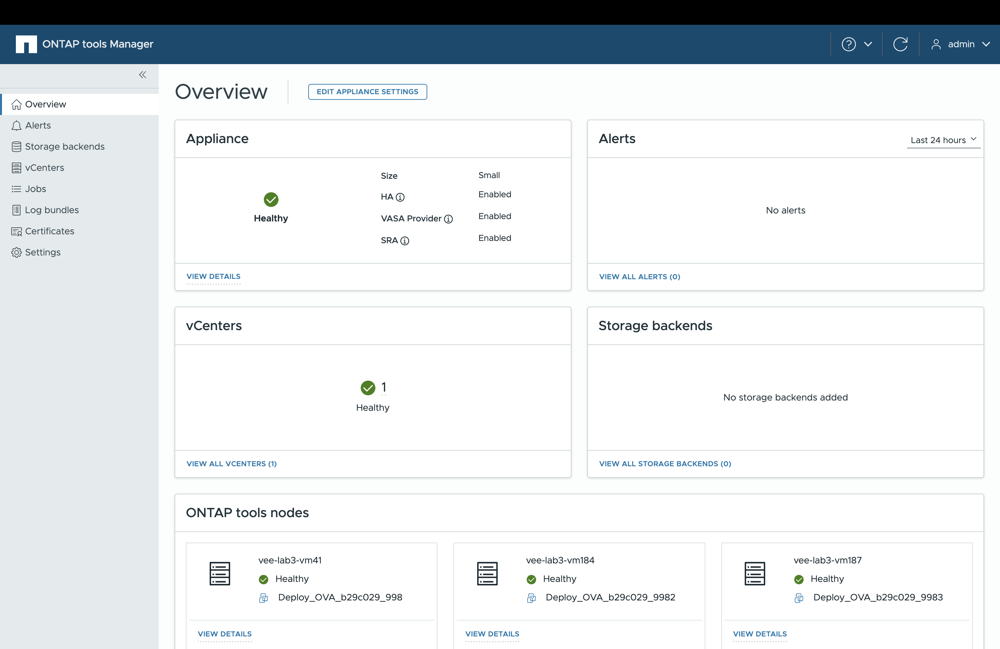

= Scopri l'interfaccia utente di ONTAP tools Manager
:allow-uri-read: 
:icons: font
:imagesdir: ../media/

[role="lead"]
ONTAP tools for VMware vSphere supporta il multi-tenancy, permettendo la gestione di più istanze di vCenter Server.

ONTAP tools Manager è una console basata sul web per gestire ONTAP tools per VMware vSphere, vCenter Server, backend di storage e configurazione dell'appliance come High Availability (HA) e il dimensionamento dei nodi.

ONTAP tools Manager offre le seguenti funzionalità:

* Gestisci gli avvisi: visualizza e filtra gli avvisi generati dagli ONTAP tools for VMware vSphere.
* Gestisci i backend di storage: aggiungi e gestisci i cluster di storage ONTAP e mappali alle istanze del server vCenter a livello globale.
* Gestisci le istanze del server vCenter - aggiungi e gestisci le istanze del server vCenter all'interno degli ONTAP tools.
* Monitora i processi: monitora ed esegui il debug dei processi asincroni avviati sia dall'interfaccia del plug-in ONTAP tools che dall'interfaccia di ONTAP tools Manager. Puoi filtrare i processi per periodo di tempo, regolare la dimensione della pagina e visualizzare i dettagli del processo, inclusi errori e sotto-attività. Fai clic sullo stato "Non riuscito" per visualizzare i dettagli dell'errore. Per i processi con sotto-attività, espandi la riga per visualizzare descrizioni e stati. Per i sotto-processi, utilizza la funzione di drilldown del processo per visualizzarne i dettagli.
* Scarica i pacchetti di log - raccogli i file di log per risolvere i problemi degli ONTAP tools for VMware vSphere.
* Gestisci i certificati: sostituisci il certificato autofirmato con un certificato CA personalizzato e rinnova o aggiorna i certificati per VASA Provider e ONTAP tools.
* Reimposta password - Cambia la password per il VASA Provider e SRA.
* Gestisci le impostazioni dell'appliance: configura l'appliance ONTAP tools, inclusa l'abilitazione dell'HA e l'aumento delle dimensioni dei nodi.

Per accedere a ONTAP tools Manager, avvia  `\https://<ONTAPtoolsIP>:8443/virtualization/ui/` dal browser ed effettua l'accesso con le credenziali di amministratore di ONTAP tools for VMware vSphere che hai fornito durante la distribuzione.

|===
| *Scheda* | *Descrizione* 

| Scheda appliance | La scheda Appliance mostra lo stato generale dell'appliance ONTAP tools, i dettagli di configurazione e lo stato dei servizi abilitati. Per visualizzare ulteriori informazioni, seleziona il link *Visualizza dettagli*. Se cambi un'impostazione dell'appliance, la scheda mostra lo stato e i dettagli del job fino al completamento della modifica. 

| Scheda avvisi | La scheda Avvisi mostra gli avvisi di ONTAP tools categorizzati per tipo, inclusi gli avvisi a livello di nodo HA. Puoi visualizzare gli avvisi dettagliati facendo clic sul hyperlink, che ti porta alla pagina degli avvisi filtrata in base al tipo di avviso selezionato. 

| Scheda vCenters | La scheda vCenters mostra lo stato di salute di tutte le istanze vCenter Server gestite da ONTAP tools. Puoi visualizzare i dettagli di ciascun vCenter selezionando il collegamento corrispondente, che porta a una pagina con ulteriori informazioni sull'istanza selezionata. 

| Scheda backend di storage | La scheda Storage backends mostra lo stato di integrità e connettività di tutti i cluster di storage ONTAP configurati in ONTAP tools. Puoi visualizzare i dettagli per ciascun storage backend selezionando il link corrispondente, che ti porta a una pagina con più informazioni sul cluster selezionato. 

| Scheda nodi ONTAP tools | La scheda dei nodi di ONTAP tools mostra tutti i nodi dell'appliance, inclusi nome del nodo, nome della VM, stato e informazioni di rete. Seleziona *Visualizza dettagli* per vedere più dettagli su un nodo specifico. [NOTA] In una configurazione non HA, appare un solo nodo. In una configurazione HA, vengono visualizzati tre nodi. 
|===