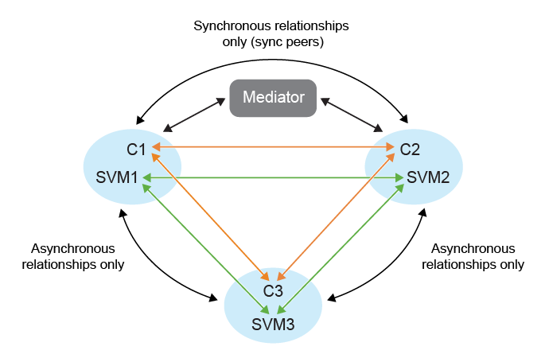

= Protezione fan-out negli ONTAP tools
:allow-uri-read: 
:icons: font
:imagesdir: ../media/

[role="lead"]
In uno scenario di protezione fan-out, il gruppo di coerenza è protetto due volte: con una relazione sincrona sul primo cluster ONTAP di destinazione e con una relazione asincrona sul secondo cluster ONTAP di destinazione. I workflow di creazione, modifica ed eliminazione della protezione SnapMirror active sync mantengono la protezione sincrona. I workflow di failover e riprotezione dell'appliance VMware Live Site Recovery mantengono la protezione asincrona.

NOTE: La funzionalità fan-out non è supportata per gli utenti SVM.

Per configurare la protezione fan-out, effettua il peering tra i tre cluster del sito e gli SVM.

Esempio:

|===

| Se | Poi 

 a| 
* Il gruppo di coerenza della fonte si trova sul cluster c1 e sulla SVM svm1
* Il primo gruppo di coerenza di destinazione si trova sul cluster c2 e sull'SVM svm2 e
* Il secondo gruppo di coerenza di destinazione si trova sul cluster c3 e sull'SVM svm3

 a| 
* Il peering del cluster sul cluster ONTAP di origine sarà (C1, C2) e (C1, C3).
* Il cluster peering sul primo cluster di destinazione ONTAP sarà (C2, C1) e (C2, C3) e
* Il peering del cluster sul secondo cluster di destinazione ONTAP sarà (C3, C1) e (C3, C2).
* Il peering SVM sull'SVM sorgente sarà (svm1, svm2) e (svm1, svm3).
* Il peering SVM sulla prima SVM di destinazione sarà (svm2, svm1) e (svm2, svm3) e
* Il peering SVM sulla seconda SVM di destinazione sarà (svm3, svm1) e (svm3, svm2).

|===
Il diagramma seguente mostra la configurazione della protezione fan-out: image:../media/fan-out-protection.png["Configurazione della protezione fan-out"] 

.Passaggi
. Selezionare un nuovo archivio dati segnaposto. I criteri di selezione dell'archivio dati segnaposto per la protezione graduale sono:
+
** Non posizionare il datastore segnaposto nel cluster che stai proteggendo.
** Se è necessario includere il datastore segnaposto nel cluster host, aggiungerlo all'appliance VMware Live Site Recovery prima di configurare la protezione della sincronizzazione attiva SnapMirror. Con questa configurazione, è possibile escludere il datastore segnaposto dalla protezione.
+
Per ulteriori informazioni, fare riferimento a https://techdocs.broadcom.com/us/en/vmware-cis/live-recovery/site-recovery-manager/8-8/site-recovery-manager-administration-8-8/about-placeholder-virtual-machines/configure-a-placeholder-datastore.html["Seleziona un datastore segnaposto"]

. Aggiungere i datastore alla protezione del cluster host seguendo link:../manage/edit-hostcluster-protection.html["Modifica cluster protetto"]. Aggiungere sia i tipi di policy asincroni che sincroni.

